## :pushpin: Project Background  
Given sales data for an online office supply retailer that ships office supplies to individual consumers and corporations nationwide, the goal of this project is to gather insights from the data and create recommendations for the company.

<i>In collaboration with Dilpreet Gujral and Jyotsna Kethepalli.</i>  

## :question: How it Works  
1. To get access to the system, users are asked to log in.  
    
      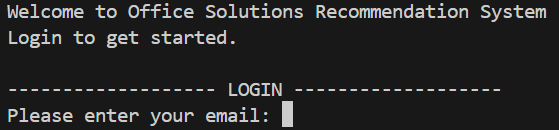
    
2. Once logged in, the user is given options.  
    
      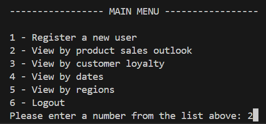
       
3. For example, if a user wants to gain insights on the most and the least profitable products, the user would enter the number 2 to be taken to the display for the product sales outlook.  
    
      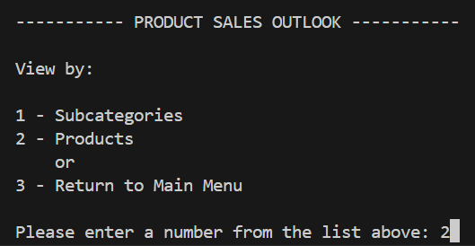
    
4. This display allows the user to choose to view the data by subcategories or products. Since we want to look at products, we would enter the number 2.  
    
      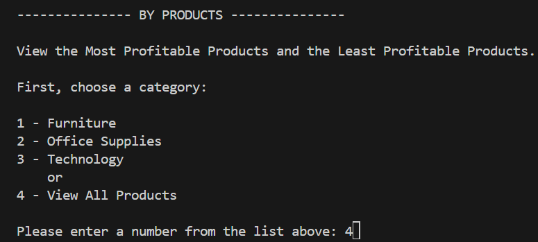
      
5. Then, the user can view products by a certain category or by all products. We will choose all products, so we will enter the number 4.  
    
      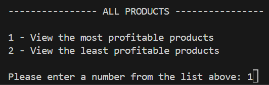
    
6. First, to view the most profitable products, we will enter the number 1. 
    
      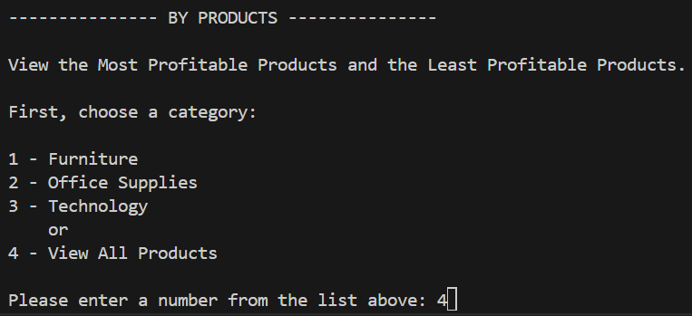
      
7. Next, the display tells the user how many total products there are and asks the user to enter a number for the number of products to be returned. 
    
      
      
8. Finally, the name and profit of the most profitable products are displayed.  Next, to get the top 5 least profitable products, we will enter the number 1 to return to the product sales outlook menu. 
    
      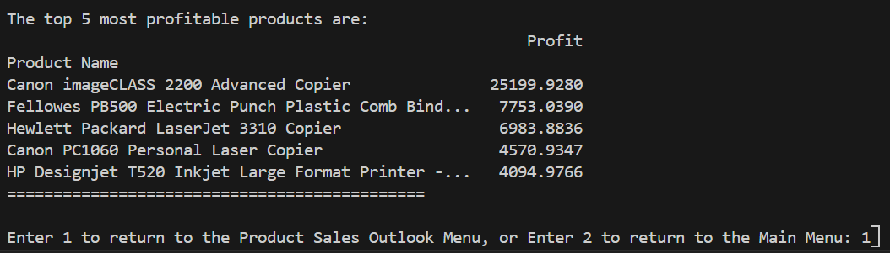
     
9. Repeating the previous steps of selecting the options to view all products from the product sales outlook menus and entering the number 2, instead of 1, in the "all products" menu to display the least profitable products, the top 5 least profitable products will be displayed.  
    
      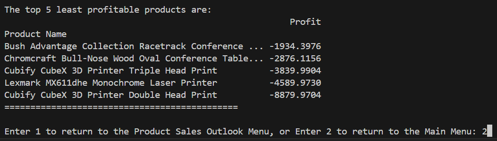
      

This is just an example of one of the many ways that users of this organization can gain insights into the company's sales data.  

## :key: Key Findings and Recommendations  
Product-Profit Correlation  
- This table shows the top 5 most profitable and top 5 least profitable products:  
    
      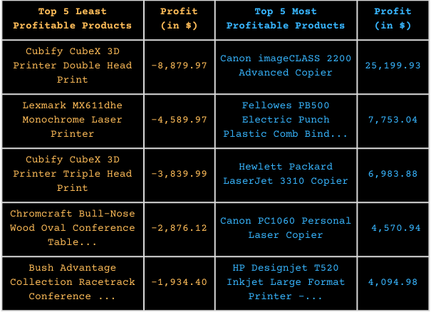
      
- Our recommendation to minimize negative profits is to review the least profitable and most profitable products and implement a mix-and-match or bundled sales promotion, where customers could purchase an underperforming product and a profitable product together.  

Profit-Quantity Sold Correlation
-  This table shows the profit and units sold by region.  
    
      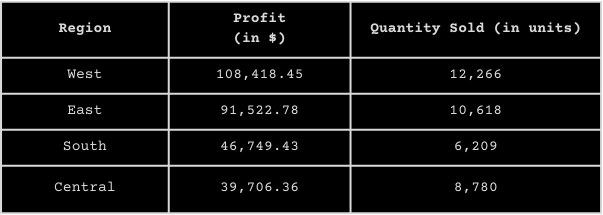
    
   It appears that the central region has the lowest profit even though it has sold more units than the south region.
- Our recommendation for this is to increase market research on the central region and decide whether or not it is worth investing in. With a better understanding of the market and customers in that region, further improvement of customer satisfaction and market strategies is possible.
- Note: when viewing the data by region, a graph will pop up depending on which insight is requested.  
    
      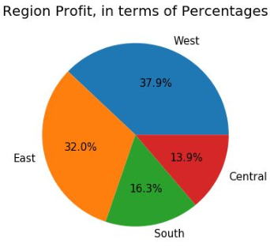&nbsp;&nbsp;&nbsp;&nbsp;&nbsp;&nbsp;
      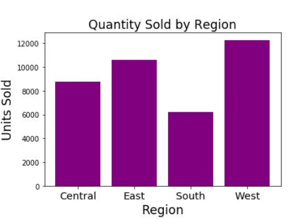
    

## :cloud: Future Project Ideas  
If I were to improve this project, I would...    
- add a "Forgot Your Password?" option on the login section
- create a user-friendly UI for the system  

